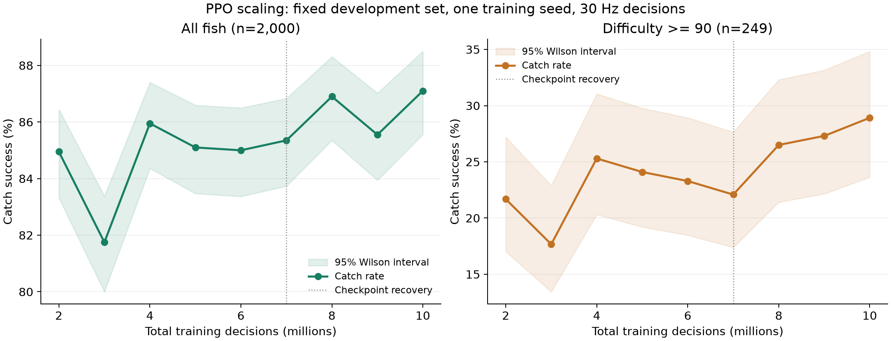

# 1000 万步实验结论

已完成从 2,002,944 步到 10,001,216 步的 PPO 续训。网络、奖励、学习率、30 Hz 决策和训练鱼池保持一致。训练覆盖等级 0–10、无渔具；完整课程已经完成，续训直接使用完整鱼池。

## 独立测试结果

在训练前指定的 5,000 个新种子上进行配对评估。最终检查点同时也是开发集所选模型，测试集没有用于选模。

| 指标 | 约 200 万步 | 约 1000 万步 | 变化 |
|---|---:|---:|---:|
| 总捕获率 | 86.42% | **88.94%** | +2.52 个百分点 |
| 难度 ≥90 的捕获率（519 次） | 24.66% | **32.37%** | +7.71 个百分点 |
| 完美捕获 / 总尝试 | 38.98% | **49.48%** | +10.50 个百分点 |
| 等级 0 的捕获率（469 次） | 75.48% | **81.88%** | +6.40 个百分点 |

总体增益的 95% 配对 bootstrap 区间为 **+2.00～+3.06 个百分点**；156 次轨迹从失败变成功，30 次从成功变失败，净增加 126 次成功。整体失败率相对下降约 18.6%。这些区间只覆盖测试轨迹的不确定性，不包含训练种子变化。

基线数值与首轮报告的 85.9% 不同，是因为这里对同一个续训起点重新使用了更大的新测试集；首轮报告使用的是另一个检查点和另一批 1,000 次评估。

## 增加步数是否值得

**从 200 万到 1000 万有可测的收益，但当前还不能推断一个稳定的缩放规律。** 固定开发集上的表现为：

| 累计步数 | 200 万 | 400 万 | 600 万 | 800 万 | 1000 万 |
|---|---:|---:|---:|---:|---:|
| 捕获率 | 84.95% | 85.95% | 85.00% | 86.90% | 87.10% |

完整曲线中还存在 300 万和 900 万步时的回落。800 万到 1000 万只增加 0.20 个百分点，95% 配对区间为 -0.50～+0.95；最后这一段尚不能确认稳定提升。600 万到 1000 万则增加 2.10 个百分点，因此也不能据此认定已经收敛。

建议把进一步纯步数实验限制在 2000 万步，并继续保留检查点、使用独立评估；更有针对性的下一轮应对照困难鱼采样、记忆结构和渔具覆盖。尚未启动后续训练。

## 绿条长度、鱼类型与渔具

绿条长度已经是每帧观测的一部分，模型还读取约半秒的位置差分和按键历史。当前网络没有显式输出运动类型。

可在下一轮加入 GRU 等历史编码器和辅助分类头，预测五类运动的概率，再将概率、绿条长度和当前状态交给策略。短轨迹通常不足以可靠识别具体鱼种，类型概率更适合表达不确定性。模拟器中的类型标签可以作为训练监督；推理只根据可观测历史计算。

渔具目前只在模拟器和观测接口中支持，训练采样尚未覆盖。相同长度的绿条也可能因渔具而有不同反弹或进度损失，需要单独扩展训练分布。

## 中断、模型与原始数据

- 本次只有一个训练种子。结果来自 Pufferdle 数值模拟，未加入图像识别和真实输入延迟。
- 训练在 7,589,888 步遇到 Windows 状态文件替换错误。加入 I/O 重试和非致命日志处理后，从 7,002,944 步检查点恢复；586,944 次未保存的决策被回退。恢复会重启环境和随机流，因此不是完全连续的一次运行。
- 两段训练进程与开发集评估累计约 13.14 分钟，包含回退部分的计算时间；修复停顿、保留测试和制图另计。
- 最终模型：`runs/20260927_scaling_10m/best.zip`（与 `final.zip` 相同权重）。
- 在模拟页面选择 **PPO 最佳模型**，点击 **重新开始 / 加载权重** 即可使用。
- [完整报告](runs/20260927_scaling_10m/SCALING_REPORT.md)、[逐节点数据](runs/20260927_scaling_10m/scaling_curve.csv)、[全部统计](runs/20260927_scaling_10m/scaling_summary.json)。

